## List of visual glitches in this PC port made by Kurausukun (up to Brawly's Gym):

- The highlighting effect in the "Pokémon" logo is wrong.

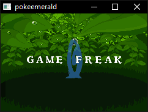

- All the menus in the game's main menu and Options menu are highlighted by default.

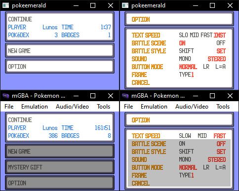

- Battle backgrounds and their intro animation look glitchy.

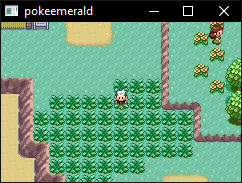

- The animation for Growl and similar moves is glitchy.

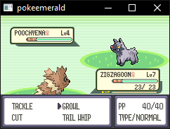

- During evolution, the common tall grass battle background is loaded for whatever reason.

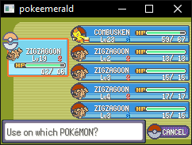

- When fishing, the sand battle background is used instead of the water one.

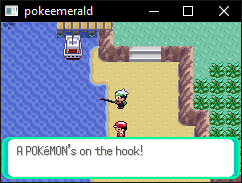

- Flash radius isn't working. Granite Cave and Brawly's Gym are fully illuminated even if you don't use Flash.

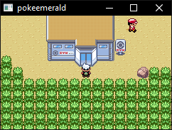

- The UI to select a move when a Pokémon learns a new one is glitchy.

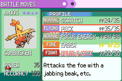

- The B button sprite in the Pokémon Summary Screen looks glitchy.

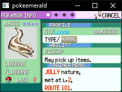

- All the pages in the Pokémon Summary Screen after the 1st one don't seem to load the correct tilemap?

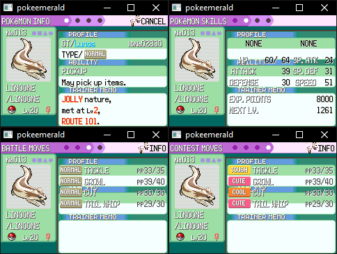

- Some of the elements in the Pokédex interface are visually incorrect, like the tools bar in the upper side or the areas around the species description box.

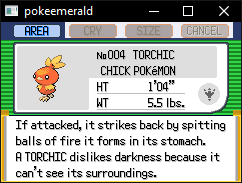

- The same goes for Rusturf Tunnel, although all in all, it's working better than it does on NO$GBA, lol.

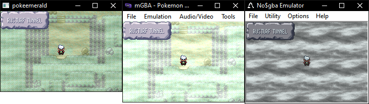
